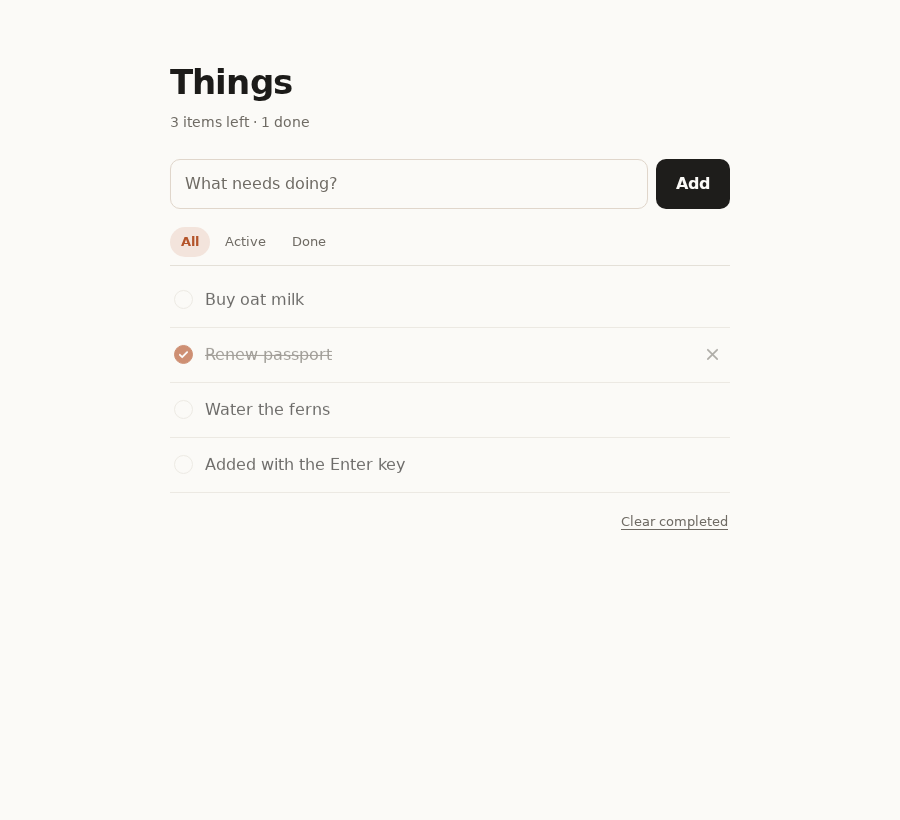

# Things — a one-page to-do list

Add, complete, delete. One page, no login, no accounts, no build step.



## Stack

Deliberately boring, so it runs anywhere with Node installed:

- **Server** — Node.js built-in `http` module. Zero npm dependencies.
- **Frontend** — plain HTML/CSS/JS, no framework, no bundler.
- **Storage** — a `data.json` file next to the server, so your list survives a restart.
- **Tests** — Playwright (Python) driving real Chromium.

## Run it

```bash
node server.js
# → todo app listening on http://localhost:3000
```

Then open <http://localhost:3000>. Set `PORT` to use a different port.

## What it does

| Feature | Notes |
| --- | --- |
| **Add** | Type and hit `Add` or `Enter`. Blank/whitespace-only input is rejected. |
| **Complete** | Click the circle. Strike-through, and the counter updates. Click again to un-complete. |
| **Delete** | Hover a row and click the `×`. |
| **Filters** | All / Active / Done. |
| **Clear completed** | Appears only when something is completed. |
| **Persistence** | State lives on the server, not in localStorage — reload or reopen and it's still there. |

Dark mode follows your OS setting. Titles are rendered as text, so HTML pasted into a to-do
is escaped rather than injected.

## API

The UI is a thin client over a small JSON API:

| Method | Path | Body | Purpose |
| --- | --- | --- | --- |
| `GET` | `/api/todos` | — | List all to-dos |
| `POST` | `/api/todos` | `{"title": "..."}` | Create one (`201`) |
| `PATCH` | `/api/todos/:id` | `{"done": true}` | Complete / un-complete |
| `DELETE` | `/api/todos/:id` | — | Delete one |

```bash
curl localhost:3000/api/todos
curl -X POST localhost:3000/api/todos -H 'Content-Type: application/json' -d '{"title":"Buy oat milk"}'
```

## Tests

```bash
python3 tests/test_todo.py
```

The suite starts its own server on a free port with a throwaway data file, so running it
never touches your real list. It drives real Chromium — clicking checkboxes, typing into the
input, reloading the page — and asserts on what the browser actually renders.

**30/30 checks pass.** Full log in [`artifacts/test-report.txt`](artifacts/test-report.txt).

Beyond the three core features, it also verifies:

- The counter and empty-state text stay in sync with the list.
- Completed rows genuinely compute to `text-decoration-line: line-through` in the browser,
  not just that a CSS class was added.
- State survives a full page reload, and `GET /api/todos` agrees with what the UI shows —
  proving it's really server-persisted.
- HTML in a to-do title is escaped, with no element created from the injected markup.
- No JavaScript errors reach the browser console during the entire run.

Screenshots from the run are in [`artifacts/`](artifacts/): items added, one completed,
one deleted, and the final state.

### A note on this box

Chromium here needs `libnspr4`/`libnss3`, which live in a side-loaded bundle rather than the
default loader path — a bare `pw.chromium.launch()` fails with a shared-library error. The
test script detects that bundle and sets `LD_LIBRARY_PATH` itself before launching, so
`python3 tests/test_todo.py` just works with no environment setup.

## Layout

```
server.js              HTTP server + JSON API + file persistence
public/
  index.html           the one page
  styles.css           styling, light + dark
  app.js               UI logic, talks to the API
tests/
  test_todo.py         Playwright end-to-end suite
artifacts/             screenshots + test report
```
